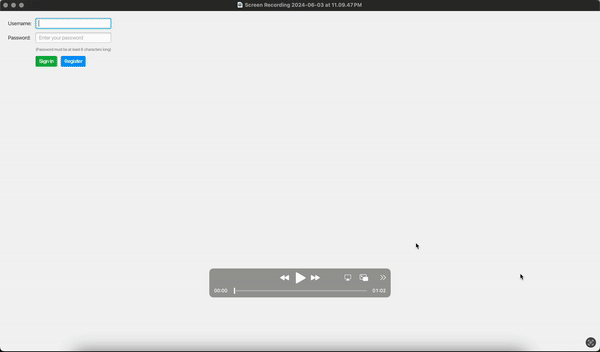

# E Learning Platform

## Table of Contents

- [Introduction](#introduction)
- [Features](#features)
- [Future Implementations](#future-implementations)
- [Usage](#usage)
- [Requirements](#technical-requirements)
- [Setup](#setup-and-installation)
- [Project Structure](#project-structure)
- [Contributing](#contribution)
- [Interface](#interface)

## Introduction <a name="introduction"></a>

The E-learning Platform provides users worldwide with free access to educational materials, enabling them to upload, access, update, and delete files. Aligned with UN Sustainable Development Goals, it promotes quality education, economic growth, innovation, and reduced inequality. With features like user authentication, file management, and search functionality, it facilitates seamless learning experiences and knowledge sharing.

## Features <a name="features"></a>

&#10004; **User Registration:** Users can register with unique usernames and emails. _(Implemented by Group-J)_

&#10004; **User Authentication (Login):** Users can log in using their registered username or email and password. _(Implemented by Group-J)_

&#10004; **Home Page:** Displays all authors uploaded materials in a table format, with search and sorting functionality. _(Implemented by Group-J)_

&#10004; **Material Management:** Users can delete and edit their own materials. _(Implemented by Group-J)_

&#10004; **Download Materials:** Users can also downloads materials. _(Implemented by Group-J)_

&#10004; **Profile Management:** Users can update their profile information, including email, name, and password. _(Implemented by Group-J)_

&#10004; **Navigation:** Easy navigation through screens using tabs. _(Implemented by Group-J)_

&#10004; **Notifications:** Success notifications are displayed upon successful API responses. _(Implemented by Group-J)_

&#10004; **Logout:** Users can log out from the application. _(Implemented by Group-J)_

&#10004; **Validation:** Implemented for Sign Up, Sign In, Material Create, Update, Delete, and User Profile Edit. _(Implemented by Group-J)_

&#10004; **Backend APIs:** All backend API creation is done using an SQL database. _(Implemented by Group-J)_

&#10004; **CLI Implementation:** User can also use the features of E Learning Platform with the help of CLI _(Implemented by Group-C)_

&#9744; **Performance:** Designed to be responsive and performant even with a large number of materials.

## Future Implementations <a name="future-implementations"></a>

##### Note: As you finish the implementation of the features below, remove them from here and add them to the Features section above.

- **Forgot Password:** Temporary password via email for password recovery.
- **Rating Material:** Update username, password, and profile photo.
- **Multi-language Support:** Support for multiple languages.
- **Time Zone Selection:** Set time zones for events.
- **Admin Panel:** Manage database with an admin role.

## Usage <a name="usage"></a>

1. **Register a New User:**
   - Provide a unique username and email, name and password.
   - Password must be at least 6 characters long and confirmed correctly.
2. **Login:**
   - Use your registered username or email and password to log in.
3. **Upload a Material:**
   - Navigate to the Material upload section.
   - Select the file(Up to 500KB) and save.
4. **Manage Materials:**
   - View the list of all authors uploaded materials.
   - Edit or Delete your uploaded materials.
   - Download the materials by clicking on the download button.
   - Search the materials by authorname, material name or id to filter out the material.
   - Sort the materials by clicking on the title of the columns.
5. **Edit Profile:**
   - Navigate to the Edit Profile section.
   - Change the detail(s) and click on save button.
6. **Logout**
   - Navigate to the logout tab and confirm the logout.

## Technical Requirements <a name="technical-requirements"></a>

- **Programming Language:** Java
- **Additional Tools & Dependencies:** JavaFX for UI, Gradle for build management
- **Database:** SQL for storing user credentials and events
- **IDEs Used:** VSCode, Eclipse
- **Version Control:** Git + Gitlab

## Setup and Installation <a name="setup-and-installation"></a>

### Repository URL

To clone the repository, use the following URL:

1. **Clone the Repository:**
   ```bash
   git clone http://se-git.medien.uni-weimar.de/se-lectures/se-sose-2024/e-learning-platform.git
   ```
   and then open the cloned repository in your preferred IDE by
   ```bash
   cd path-to-folder/e-learning-platform
   ```
2. **Install Dependencies:**
   Ensure that you have Gradle installed. Run the following command to install dependencies:
   ```bash
   gradle build
   ```
3. **Database Setup:**
   Set up an SQL database. Update the database configuration in the application to connect to your database.

4. **Run the Application:**

   For Windows users:

   ```bash
   gradlew.bat run
   ```

   OR

   ```bash
   gradlew run
   ```

   For macOS/Linux users:

   ```bash
   ./gradlew run
   ```

## Project Structure <a name="project-structure"></a>

```
E-LEARNING-PLATFORM/
│
├── build.gradle # Build configuration file
├── README.md # Project documentation
├── docs/ # Documentation files
│ ├── handover1.pdf
│ └── description.pdf
├── src/main/
│ ├── java/de/buw/se/
│ │ ├── backend/
│ │ │ ├── connection/
│ │ │ │ └── DatabaseManager.java
│ │ │ ├── context/
│ │ │ │ └── SessionContext.java
│ │ │ ├── db/
│ │ │ │ ├── MaterialDao.java
│ │ │ │ └── UserDao.java
│ │ │ ├── model/
│ │ │ │ ├── Material.java
│ │ │ │ └── User.java
│ │ │ ├── service/
│ │ │ │ ├── LoginResult.java
│ │ │ │ ├── MaterialService.java
│ │ │ │ └── UserService.java
│ │ ├── cli/
│ │ │ ├── AppCLI.java
│ │ │ ├── AppController.java
│ │ │ ├── DataStoreCsv.java
│ │ │ ├── FileManager.java
│ │ │ ├── LoginManager.java
│ │ │ └── UserAuthenticator.java
│ │ ├── frontend/
│ │ │ ├── AuthenticatedUI.java
│ │ │ ├── SigninUI.java
│ │ │ ├── SignUpUI.java
│ │ │ ├── tabs/
│ │ │ │ ├── EditProfileTab.java
│ │ │ │ ├── FileUploadTab.java
│ │ │ │ ├── LogoutTab.java
│ │ │ │ └── MaterialListingTab.java
│ │ │ ├── utils/
│ │ │ │ ├── AlertUtils.java
│ │ │ │ ├── CursorUtils.java
│ │ │ │ ├── DownloadUtils.java
│ │ │ │ ├── MaterialTabUtils.java
│ │ │ │ └── NotificationHelper.java
│ │ └── ELearningPlatform.java # Main file, make sure it is added in the build.gradle file as application
├── resources/
│ └── eLearningDB.mv.db # Database file
├── uploads/
```

## Contribution <a name="contribution"></a>

If you wish to contribute, please clone the repository and create a new branch for your changes. Ensure your code adheres to the existing coding standards. Once you've made your changes, push your branch to the repository and submit a pull request to merge it with the main branch or do it yourself if you think the code has no errors.

## Interface <a name="interface"></a>



# login Details For CLI

Use the following login details to use the application
username = user1
password = password1

OR

username = user2
password = password2
