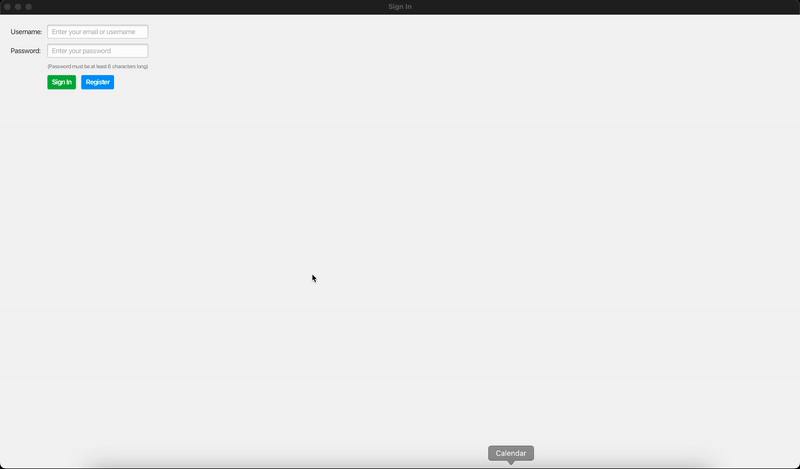

# Event Planner and Scheduler

## Table of Contents
- [Introduction](#introduction)
- [Features](#features)
- [Future Implementations](#future-implementations)
- [Usage](#usage)
- [Requirements](#technical-requirements)
- [Setup](#setup-and-installation)
- [Project Structure](#project-structure)
- [Contributing](#contribution)
- [Interface](#interface)

## Introduction <a name="introduction"></a>
The Event Planner and Scheduler is a software application designed to help individuals organize and manage their events, appointments, and tasks effectively. This project aims to provide users with an intuitive graphical interface for scheduling their daily activities and maintaining organization in their lives. The application enhances productivity and well-being by allowing users to manage tasks efficiently.

## Features <a name="features"></a>

&#10004; **Event Creation:** Users can create new events with details such as title, date, time, and description. *(Implemented by Group-J)* 

&#10004; **Task Management:** Users can manage their tasks by creating, editing (Note: Implementation of API is remaining), and deleting events. *(Implemented by Group-J)*

&#10004; **User Authentication:** The application supports multiple users, requiring authentication via unique usernames and emails. *(Implemented by Group-J)*

&#10004; **User Interface:** Simple and intuitive UI, including input fields, buttons, and lists for interaction. *(Implemented by Group-J)*

&#10004; **User Interface 2.0:** Added new icons for sign-in and sign-up page, background color and size updated. *(Implemented by Group-A)*

&#10004; **Navigation:** Easy navigation through tabs and menus to switch between different views like event lists. *(Implemented by Group-J)*

&#10004; **Database Integration:** Persistent storage of user information and events using an SQL database. *(Implemented by Group-J)*

&#10004; **Error Handling:** Clear and descriptive error messages to guide users in correcting mistakes. *(Implemented by Group-J)*

&#10004; **PDF Export:** User can now export his personal event list as pdf for easy access. *(Implemented by Group-A)*

&#9744; **Performance:** Designed to be responsive and performant even with a large number of events.


## Future Implementations <a name="future-implementations"></a>
##### Note: As you finish the implementation of the features below, remove them from here and add them to the Features section above.
- **Forgot Password:** Temporary password via email for password recovery.
- **Profile Editing:** Update username, password, and profile photo.
- **Multi-language Support:** Support for multiple languages.
- **Time Zone Selection:** Set time zones for events.
- **Admin Panel:** Manage database with an admin role.
- **Event Tags:** Categorize events by tags.
- **Calendar View:** Visual representation of schedules.
- **Command Line Interface:** CLI for the project.

## Usage <a name="usage"></a>
1. **Register a New User:**
   - Provide a unique username and email.
   - Password must be at least 6 characters long and confirmed correctly.
2. **Login:**
   - Use your registered username or email and password to log in.
3. **Create an Event:**
   - Navigate to the event creation section.
   - Fill all the required fields with valid inputs in the event details and save.
4. **Manage Events:**
   - View the list of events.
   - Edit or delete existing events as needed. <small>(Note: Event editing isn't implemented yet)</small>
   - Export event in pdf format.

## Technical Requirements <a name="technical-requirements"></a>
- **Programming Language:** Java
- **Additional Tools & Dependencies:** JavaFX for UI, Gradle for build management
- **Database:** SQL for storing user credentials and events (H2 Database)
- **IDEs Used:** VSCode, Eclipse
- **Version Control:** Git + Gitlab

## Setup and Installation <a name="setup-and-installation"></a>

### Repository URL

To clone the repository, use the following URL:
1. **Clone the Repository:**
   ```bash
   git clone http://se-git.medien.uni-weimar.de/se-lectures/se-sose-2024/event-planner-and-scheduler.git
   ```
   and then open the cloned repository in your preferred IDE by
    ```bash
    cd path-to-folder/event-planner-and-scheduler
    ```
2. **Install Dependencies:**
   Ensure that you have Gradle installed. Run the following command to install dependencies:
   ```bash
   gradle build
   ```
3. **Database Setup:**
   Set up an SQL database. Update the database configuration in the application to connect to your database.

4. **Run the Application:**

   For Windows users:
   ```bash
   gradlew.bat run
   ```

   For macOS/Linux users:
   ```bash
   ./gradlew run
   ```

## Project Structure <a name="project-structure"></a>
```
EVENT-PLANNER-AND-SCHEDULER/
│
├── build.gradle # Build configuration file
├── README.md # Project documentation
├── docs/ # Documentation files
│ ├── handover1.pdf
│ └── description.pdf
├── src/main/
│ ├── java/de/buw/se/
│ │ ├── context/
│ │ │ └── SessionContext.java
│ │ ├── db/
│ │ │ ├── DatabaseManager.java
│ │ │ ├── EventDao.java
│ │ │ └── UserDao.java
│ │ ├── model/
│ │ │ ├── Event.java
│ │ │ └── User.java
│ │ ├── service/
│ │ │ ├── EventService.java
│ │ │ ├── UserService.java
│ │ │ └── LoginResult.java
│ │ ├── UI/
│ │ │ ├── AuthenticatedUI.java
│ │ │ ├── SigninUI.java
│ │ │ ├── SignUpUI.java
│ │ │ └── Utils/
│ │ │   └── NotificationHelper.java
│ │ └── EventManagementSystem.java # Main file, make sure it is added in the build.gradle file as application
├── resources/
│ └── eventPlannerDB.mv.db # Database file
```

## Contribution <a name="contribution"></a>
If you wish to contribute, please clone the repository and create a new branch for your changes. Ensure your code adheres to the existing coding standards. Once you've made your changes, push your branch to the repository and submit a pull request to merge it with the main branch or do it yourself if you think the code has no errors.

## Interface <a name="interface"></a>


